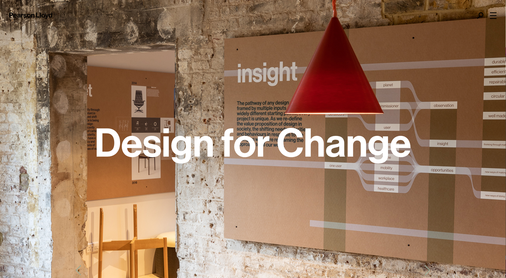
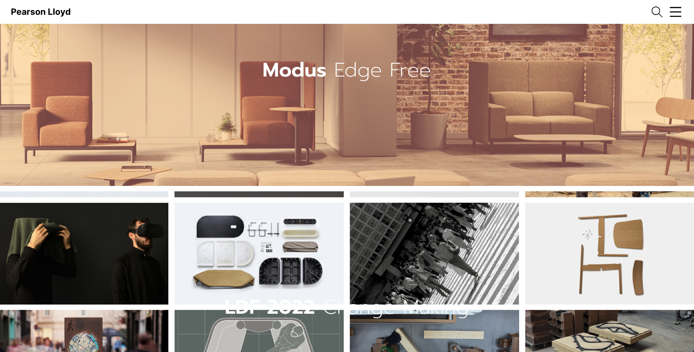
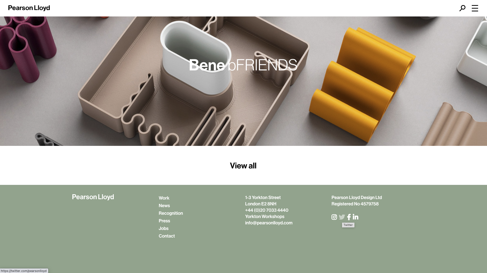
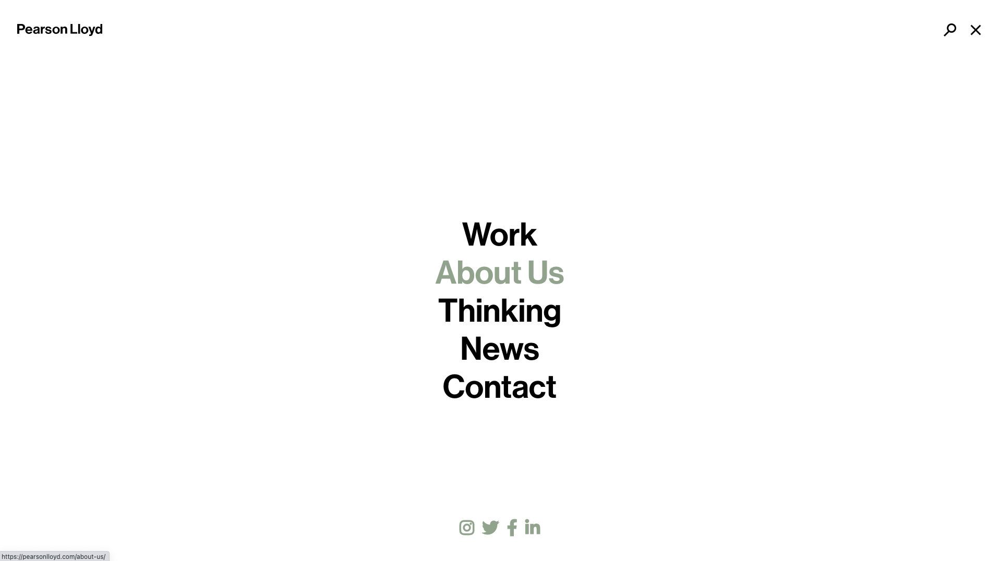
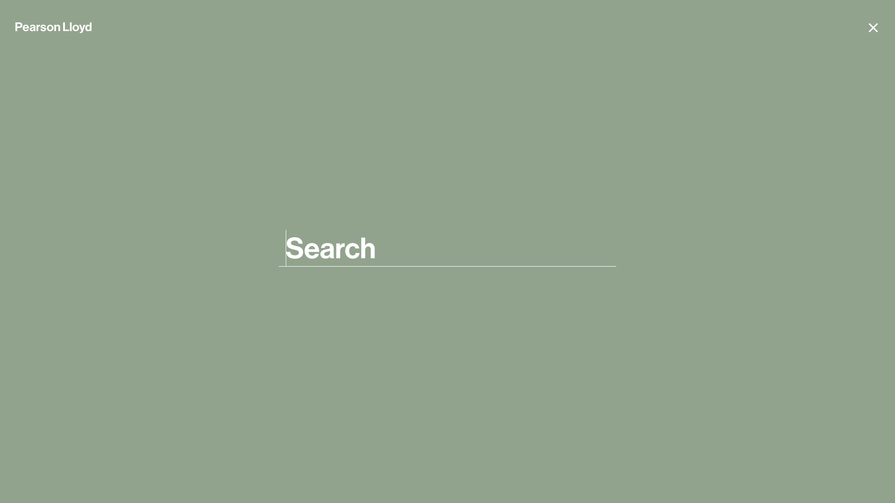

## Responsive Website Build

Welcome! I built this website to test my Website Development skills using React.js & Styled Components. The focus was to re-engineer a website, imitating it as closely as possible. I encountered many new challenges along the way and had to find ways to solve them all - which halped make this project so fun!

Attention to detail was high up on my list with regards to styles, layout, animations, responsiveness etc. Generally speaking, it's pretty in-sync with the original website. Note, the font's and icons used are not exact, but as close as possible with what I had (knowing) access to. 

## Website Links

Check out both websites and have a play around with the main page & nav bar. Please note that my focus was no the main page, the navbar menu and navbar search. Therefore I haven't added urls to link through on projects etc. With that in mind, here are the links to: 

[My website](https://responsive-website-lw.netlify.app/){:target="_blank" rel="noopener"}

[Original website](https://pearsonlloyd.com/){:target="_blank" rel="noopener"}

## A few more shots

### The footer

### The Menu

### The  Search Option

Note: These Images are all for website. Be sure to try it on different screen sizes to check the resposiveness. 